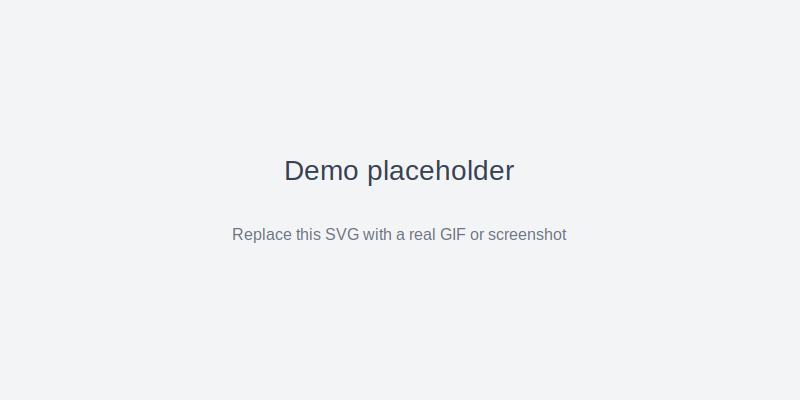

# Selenium Morningstar Visualization

## Description / Overview
This project automates extraction of fund and ETF data from Morningstar using Selenium, processes the data into CSVs, and provides simple visualizations (plots and an HTML plot snapshot). It's useful for personal research, portfolio analysis, or as a demo of automated web data collection and plotting.

## Demo
- Placeholder for demo image (SVG) or GIF:

  

  (Replace `assets/demo.svg` with a real GIF or screenshot showing the scraper and a sample plot.)

## Installation
1. Clone the repository (or copy this folder).
2. Create a Python virtual environment and activate it:

```bash
python3 -m venv venv
source venv/bin/activate
```

3. Install required packages (Selenium, pandas, matplotlib, etc.) — or install from `requirements.txt`:

```bash
pip install -r requirements.txt
```

Optional: pin versions in `requirements.txt` for reproducibility.

## Usage
- Main scripts in this folder:
  - `redo_webscraper.py` — primary scraper run (recommended)
  - `func_webscraper_test.py` — helper/test functions
  - `webscraper.ipynb` — exploratory notebook with examples and plotting

Run the scraper from the command line:

```bash
python redo_webscraper.py
```

Output will be saved into the `csv_export/` directory (sample CSV files are included). A sample static visualization is available as `temp-plot.html` and additional plots (if generated) go into `plots/`.

## Features
- Automated Selenium-based scraping of Morningstar pages
- Exports cleaned CSVs into `csv_export/`
- Quick plotting and HTML snapshot (`temp-plot.html`)
- Notebook for interactive analysis `webscraper.ipynb`

## Tech Stack / Built With
- Python 3
- Selenium for browser automation
- pandas for data processing
- matplotlib / pyplot for plotting
- Jupyter Notebook for exploration

## Contributing
Contributions are welcome. Suggested workflow:

1. Fork the repo and create a feature branch.
2. Add tests or a notebook demonstrating your change.
3. Open a pull request with a concise description.

Notes:
- Respect `robots.txt` and Morningstar's terms of service. Use scraping responsibly and throttle requests.

## License
This project is distributed under the MIT License. Add a `LICENSE` file at the repository root if needed.

## Credits / Acknowledgments
- Morningstar for the data source used in examples.
- Selenium and the Python open-source ecosystem for the tooling.

---

If you'd like, I can also:
- add an `assets/` folder and place demo image placeholders there,
- generate a minimal `requirements.txt` from the environment,
- or insert more detailed usage examples showing function arguments.
