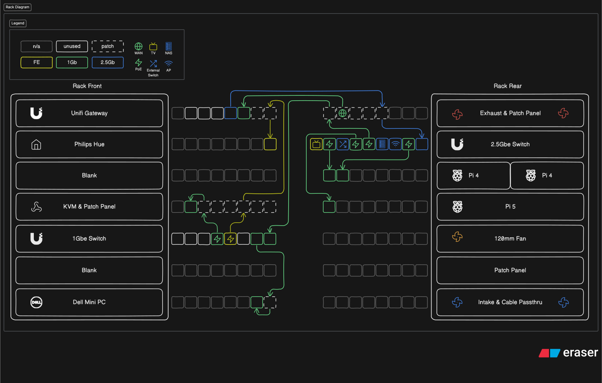
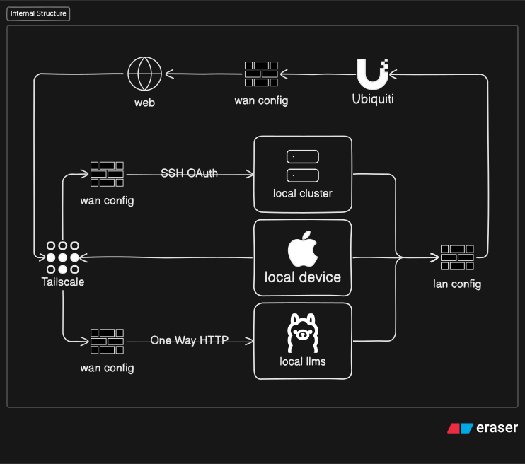
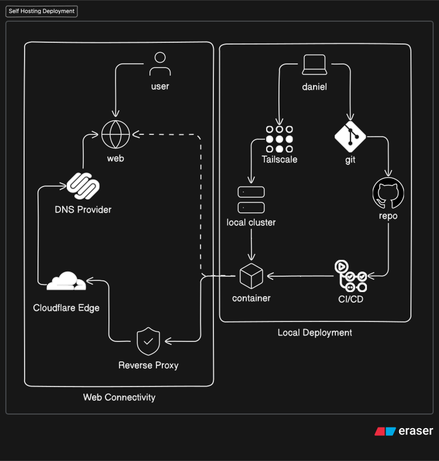
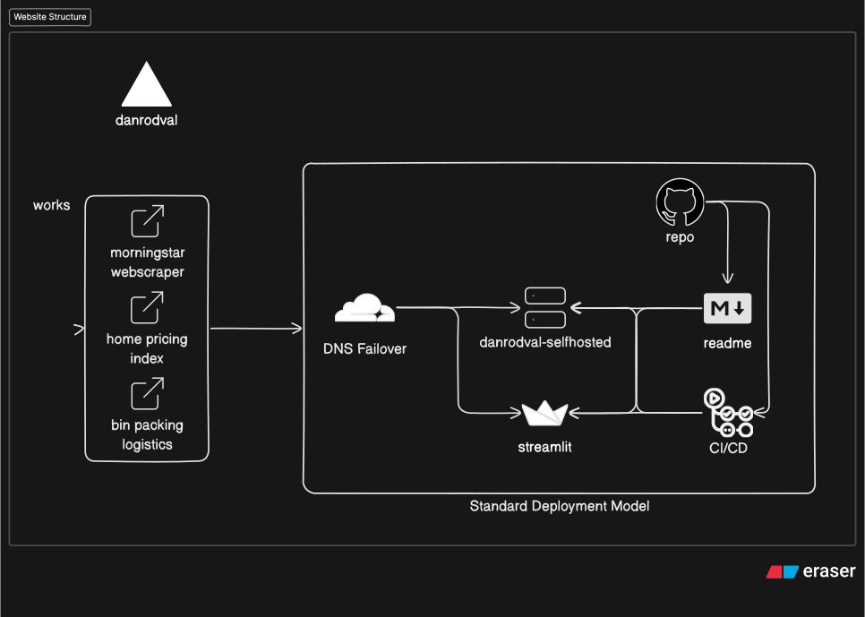

# Daniel Rodriguez

Data Scientist focused on machine learning, analytics, and data engineering, with a strong interest in the infrastructure and tooling that help technical projects run in practice.

I like building projects that turn raw data into something useful, whether that’s an ML workflow, an interactive app, a forecasting project, or a cleaner backend pipeline. A lot of my work sits at the intersection of data, coding, and implementation. Alongside that, I maintain a homelab where I experiment with deployment workflows, reverse proxies, networking, and self-hosted services.

Contact me via [LinkedIn](https://www.linkedin.com/in/danielarodval/)  
Also check out [my portfolio website](https://www.danrodval.com/)

---

## Featured Data Science & ML Projects

### [Docusign AI Integration Hackathon](https://github.com/danielarodval/docusign-hackathon-2024)
Document-focused AI project built around local/cloud-hosted tooling for extracting and interacting with agreement content.

- Streamlit app with API integration
- Local LLM integration
- Prompting / document interaction workflow
- Deployment experimentation for hosted usage

### [U.S. Home Price Forecasting with 4 Multi-Variate Regression Techniques](https://github.com/danielarodval/portfolio/tree/main/code_dir/Python/Home%20Pricing%20Insights%20from%20Treasury%20and%20Index%20Funds)
Forecasting-focused project exploring how market and treasury signals relate to U.S. home prices.

- Data aggregation and feature preparation across 4 data sources
- Hyperparameter tuning and regression testing
- Models used: Gradient Boosting, KNN, Random Forest, Linear SVR
- Sources include Zillow, Morningstar Index Funds, and U.S. Treasury SOMA data

### [Morningstar Webscraper & Visualizer](https://github.com/danielarodval/portfolio/tree/main/code_dir/Python/Selenium%20Morningstar%20Visualization)
Financial data collection and visualization project focused on scraping, structuring, and exploring Morningstar data.

- Selenium-based data extraction
- Plotly visualization
- Financial data replication and transformation

### [Bin Packing Algorithm Testing](https://github.com/danielarodval/st-bin-packing)
Optimization-focused project centered on algorithm testing and interactive deployment.

- Streamlit deployment
- Network flow and bin-packing experimentation
- Applied problem solving / algorithm design

### [Machine Learning vs. Neural Network Clustering](https://github.com/danielarodval/portfolio/tree/main/code_dir/Python/Neural%20Network%20Attempt%20at%20Clustering)
Comparative experimentation project exploring clustering-style workflows and PyTorch-based testing.

- PyTorch experimentation
- Clustering comparison workflow
- Iterative modeling exploration

---

## Applied Engineering Projects

These projects are more engineering and deployment oriented, but still reflect how I like building and shipping technical work.

### [AMP Game Server Monitor](https://github.com/danielarodval/amp-monitor)
Python-based full-stack monitoring project.

- FastAPI backend
- Neon Postgres
- Reflex UI
- Monitoring + deployment workflow

### [Backend Testing for Full-Stack with Neon Postgres](https://github.com/danielarodval/backend-testing-neon-postgres)
Backend experimentation repo for database integration and application structure.

- Docker containerization
- ORM tooling
- Database-backed testing workflow

### [Reverse Proxy Test](https://github.com/danielarodval/local-host-test-site)
Proof-of-concept deployment repo for reverse proxy and container hosting.

- Reverse proxy setup
- Docker-based containerization
- GitHub-linked CI/CD experimentation

### [JavaScript Website](https://github.com/danielarodval/js-site)
Frontend project using Chakra UI and Vercel hosting.

- JavaScript web development
- Chakra UI
- Vercel deployment

---

## Homelab & Infrastructure

Outside of my core data work, I maintain a homelab where I test deployment workflows, reverse proxies, remote access, internal networking, and service architecture. It’s a technical playground that complements my broader interest in building end-to-end projects.

### Homelab Docs 🏠
- [Rack Diagram & Photos](#rack-diagram--photos)
- [Network Configuration](#network-configuration)
- [Deployment Pipeline](#deployment-pipeline)
- [Website Structure](#website-structure)

### Current Areas of Interest
- Cluster computing with Kubernetes
- Always-on local VLLM tooling with OpenClaw
- DNS failover for cloud backup hosted sites

---

## Rack Diagram & Photos

The server rack was created using an IKEA Eket cabinet alongside four 7U rails and a frame using 1x12 and 2x10 wood pieces, allowing for roughly 10 inches of shared mounting depth between front and back devices.

Most of the mounts were sourced online and then modified in TinkerCAD, including patches for ethernet access and split-part adjustments to fit a 180mm 3D printer limitation.

---

## Network Configuration

Networking is configured through UniFi OS across the environment, with an emphasis on device isolation, segmentation, and minimizing unnecessary traffic flow between services.

---

## Deployment Pipeline

The reverse proxy test project was used as a proof of concept for isolated hosting, Docker-based services, and Cloudflare Tunnel exposure.

Live test site: [test.danrodval-selfhosted.com](https://test.danrodval-selfhosted.com/)

---

## Website Structure

The intended portfolio structure is:

1. Rebase home-pricing, clustering, and web-scraping projects into Streamlit apps
2. Containerize those apps
3. Host them on subdomains of the portfolio site
4. Add DNS failover checks so backup deployments can respond if the primary app is unavailable

