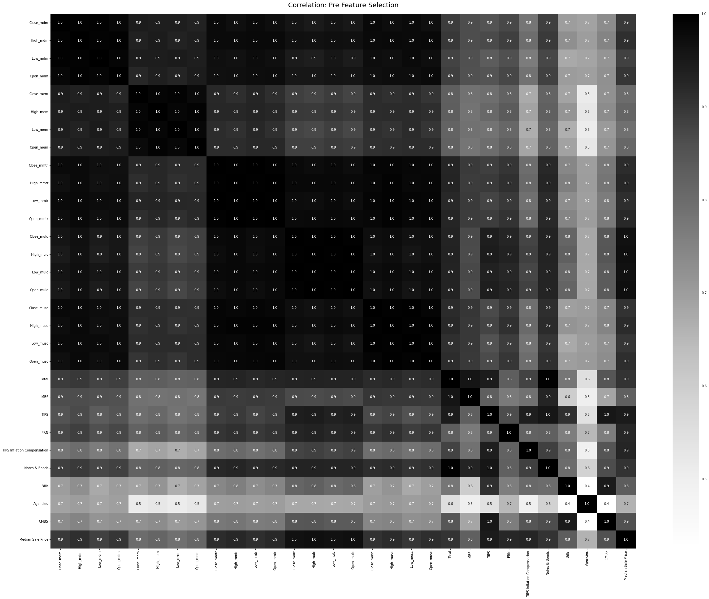
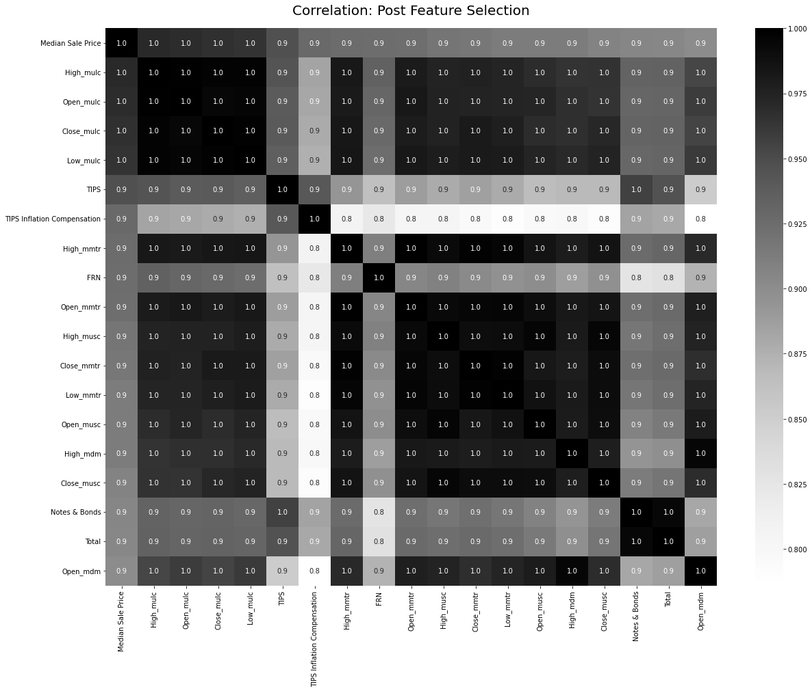
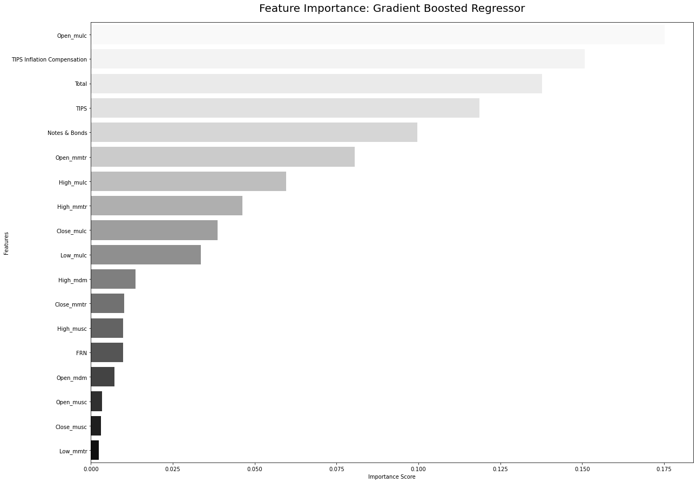
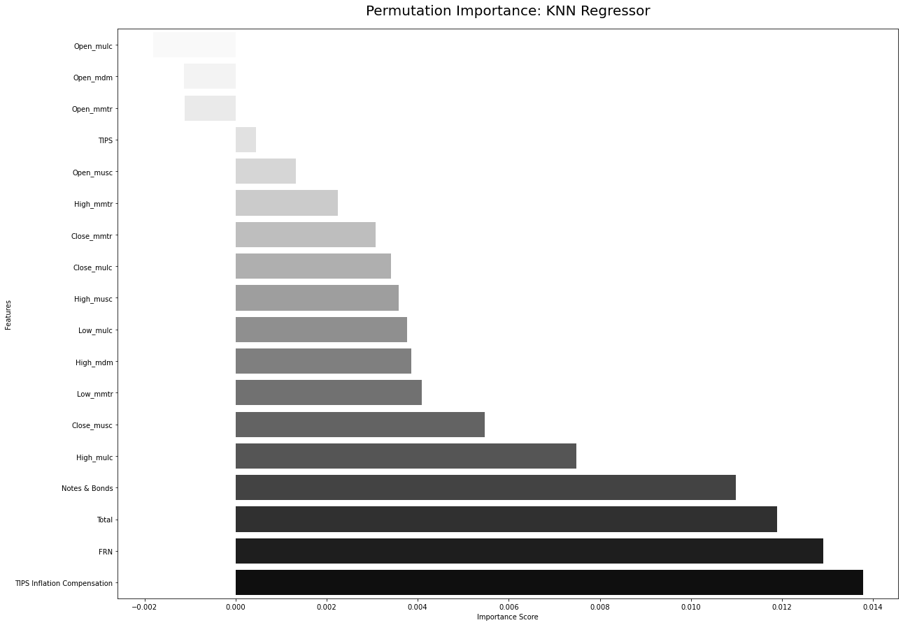
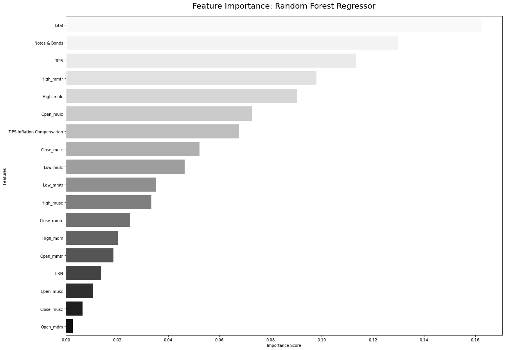
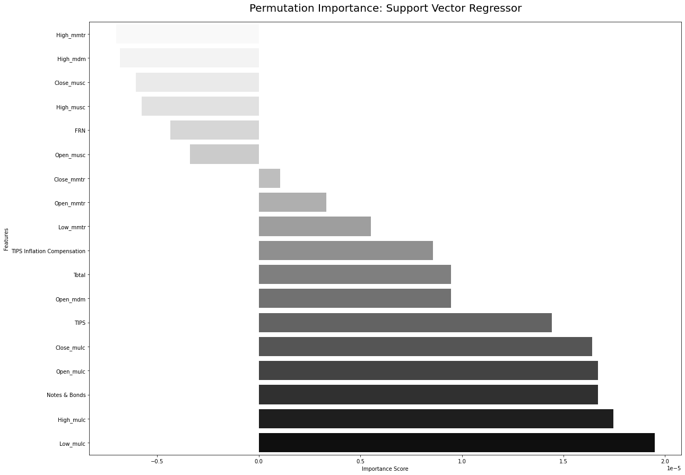

# Home Pricing Insights — Treasury & Index Funds Forecasting

## Description / Overview
This project analyzes home pricing trends by combining Zillow median sale price data with Treasury and Morningstar index data. It performs data cleaning and feature selection, fits and tunes multiple regression models (Gradient Boosting, Random Forest, SVR, KNN), and produces diagnostic plots and feature-importance charts. Intended for data scientists and students exploring macro-driven housing price forecasting.

## Demo


_Replace the images above with GIFs or plots from `plots/` for a richer README._

## Installation
1. Clone the repository and change into the project folder:

```bash
git clone <repo-url>
cd portfolio/Python/Home\ Pricing\ Insights\ from\ Treasury\ and\ Index\ Funds
```

2. Create and activate a Python virtual environment (Python 3.8+ recommended):

```bash
python3 -m venv venv
source venv/bin/activate
```

3. Install dependencies. If a `requirements.txt` exists at the repo root, use that; otherwise install the main libs used:

```bash
pip install -r requirements.txt  # if provided
# or
pip install pandas numpy scikit-learn seaborn matplotlib prettytable
```

4. Ensure the `data/` directory contains the CSV files used by the script (example filenames are provided in the project folder).

## Usage
- Run the analysis script to preprocess data, train models, and generate plots:

```bash
python forecastingscript.py
```

- Typical outputs:
   - Console logs with model scores and best hyperparameters
   - Plot windows (matplotlib/seaborn) for correlation matrices and feature importances
   - Saved/exported images if you add saving code to the plotting sections

## Features
- Loads and harmonizes multiple CSV sources (Zillow median sale prices, Morningstar indexes, summary stats)
- Handles datetime indexing and monthly aggregation
- Missing-value diagnostics and visualizations
- Feature selection via correlation and permutation importance
- Trains and hyperparameter-tunes Gradient Boosting, Random Forest, SVR, and KNN models
- Visualizes model feature importances and correlation matrices

## Tech Stack / Built With
- Python 3.8+
- pandas, numpy
- scikit-learn (models, GridSearchCV, preprocessing)
- seaborn, matplotlib (visualizations)
- prettytable (results formatting)

## Contributing
- Contributions welcome. Please open an issue first to discuss significant changes.
- Suggested workflow:
   1. Fork the repo
 2. Create a feature branch: `git checkout -b feature/xyz`
 3. Open a PR with tests or examples showing the change

## License
See the repository `LICENSE` file for terms. If no license is present, assume "All rights reserved" until a license is added.

## Credits / Acknowledgments
- Authors / contributors: Daniel Rodriguez, Kzzy Centeno, Mir Khan, Sriharsha Aitharaju (listed in `forecastingscript.py`).
- Thanks to open-source libraries used for data science and visualization.

---

File: [forecastingscript.py](forecastingscript.py)

If you'd like, I can add example screenshots into `plots/`, export the main figures automatically, or create a `requirements.txt` tailored to `forecastingscript.py`'s imports.

### Key Features

- **Data Sources**: Utilizes data from Treasury Securities Holdings, Morningstar Index Funds, and Zillow.
- **Machine Learning Models**: Employs models like KNN Regression, Gradient Boosted Trees, Random Forest, and Support Vector Regression.
- **Data Preprocessing and Feature Selection**: Ensures data consistency and relevance by selecting impactful features.
- **Model Comparison and Tuning**: Evaluates models based on performance metrics and tunes them for optimal results.

### Dependencies

- Scikit-learn
- Pandas
- Numpy
- Matplotlib
- Seaborn

### Implementation

#### Data Collection and Preprocessing

1. **Data Integration**: Combines datasets from different sources with varying inception dates.
2. **Normalization**: Standardizes features using Scikit-learn's StandardScaler.

   ```python
   # StandardScaler implementation
   ```

#### Machine Learning Models

1. Multiple machine learning models are employed for analysis.
2. Hyperparameter tuning is done using GridSearchCV for optimal model performance.

   ```python
   # Example model implementation
   ```

#### Insights and Analysis

- Analyzing the feature importance across models to understand the economic indicators' impact on housing prices.
- Includes a detailed comparison of model performances before and after tuning.

### Results

- Gradient Boosted Regressor emerged as the most effective model.
- The project provides valuable insights for investors, policymakers, and industry practitioners.

### Figures and Visualizations

- Include figures and visualizations relevant to the project. (Upload images to GitHub and link them here)













### Conclusion

- Discusses the practical implications of the findings.
- Suggests avenues for further enhancement like deep learning approaches and efficiency tuning.

### References

- Morningstar US Large Cap: [Link](https://indexes.morningstar.com/indexes/details/morningstar-us-large-capFSUSA00KH5)
- Zillow Research Data: [Link](https://www.zillow.com/research/data/)
- Other relevant references.

---

**Note**: Replace `link-to-figure-1`, `link-to-figure-2`, etc., with actual URLs of the images once they are uploaded to your GitHub repository. This README provides a comprehensive overview of your project and can be placed in the respective project directory on GitHub.